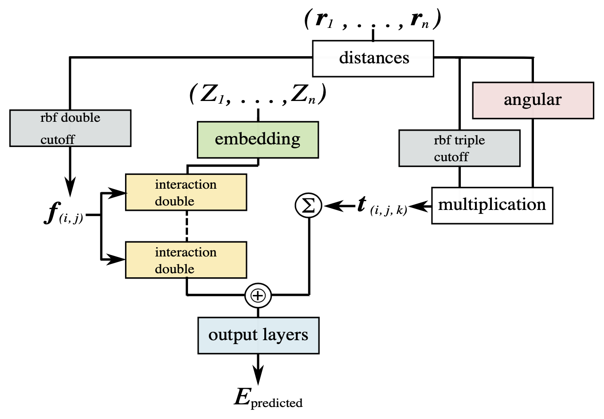

# SchNetTriple

[](https://app.travis-ci.com/github/ken2403/schnettriple)
[](https://github.com/python/black)



SchNetTriple is an atomistic neural network potential modeled by adding the three-body interaction inspired by the angular symmetry fucntion of ANI-1[3] to learning process of SchNet [1, 2].

**Requirements:**

- python 3
- ASE
- numpy
- PyTorch (>=1.7)
- schnetpack
- h5py
- Optional: tensorboardX  

***Note: We recommend using a GPU for training the neural networks.***

## Installation

Install this project by `git`.

### Clone the repository

```bash
git clone https://github.com/ken2403/schnettriple.git
cd schnetpack
```

### Install requirements

```bash
pip install -r requirements.txt
```

### Install SchNetTriple

```bash
pip install .
```

You're ready to go!

## Getting started

The example scripts provided by SchNetTriple are inserted into your PATH during installation.

### Preparing the dataset

Prepare the dataset in [ase database format](https://wiki.fysik.dtu.dk/ase/ase/db/db.html).
Or prepare a atoms `.xyz` file and convert it to ase database using the script provided by schnetpack.

```bash
spk_parse.py  /path_to_xyz  /save_path_to_db
```

### Preparing argument file

Prepare the `.json` file that defines the hyperparameters for training.
The example file can be found in `schnettriple/src/scripts/`
If the argument `.json` file is ready, you can train the model like this way.

```bash
snt_run  from_json  /path_to_train.json
```

Learned model are saved as `best_model` in model direcctory.

### Evaluating learned model

The same script can also be used to evaluate the learned model.
Prepare a `.json` file for evaluation.

```bash
snt_run  from_json  /path_to_eval.json
```

Write a result file `evaluation.txt` into the model directory.

### Using POSCAR file as an input

You can also input one `POSCAR` structure file into the learned model to calculate total energy and interatomic forces.
This is useful for phonon calculations with [phonopy](https://phonopy.github.io/phonopy/).

```bash
snt_run  from_poscar  /path_to_POSCAR  /path_to_learned_model  --cutoff  cutoff_radious  [--cuda]
```

If GPU is availabel, set `--cuda`.
The calculation results are written to `schnettriple_run.xml` file and saved in the same directory as the `POSCAR`.

## References

- [1] K. T. Schütt, H. E. Sauceda, P.-J. Kindermans, A. Tkatchenko, K.-R. Müller, *SchNet - A deep learning architecture for molecules and materials.* J. Chem. Phys. **148**, 241722 (2018). [link](https://aip.scitation.org/doi/10.1063/1.5019779)
  
- [2] K. T. Schütt, P. Kessel, M. Gastegger, K. A. Nicoli, A. Tkatchenko, K.-R. Müller, *SchNetPack: A deep learning toolbox for atomistic systems.* J. Chem. Theory Comput. **15**, 448–455 (2019). [link](https://pubs.acs.org/doi/10.1021/acs.jctc.8b00908)

- [3] J. S. Smith, O. Isayev, A. E. Roitberg, *ANI-1: an extensible neural network potential with DFT accuracy at force field computational cost.* Chem. Sci. **8**, 3192–3203 (2017). [link](https://pubs.rsc.org/en/content/articlelanding/2017/SC/C6SC05720A)

- [4] X. Gao, F. Ramezanghorbani, O. Isayev, J. S. Smith, A. E. Roitberg, *TorchANI: A Free and Open Source PyTorch-Based Deep Learning Implementation of the ANI Neural Network Potentials.* J. Chem. Inf. Model. **60**, 3408–3415 (2020). [link](https://pubs.acs.org/doi/10.1021/acs.jcim.0c00451)
